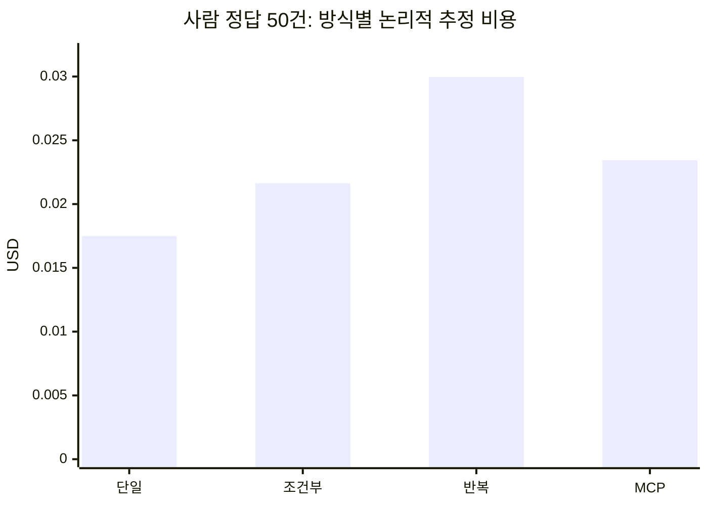

# 상담 분석 비교 결과와 한계

사람 정답 50건에서는 네 방식의 원시 키워드 집합이 사례별로 모두 같았다. 에이전트 비용은 단일 호출보다 33.96% 높았다. 현재 키워드 과제에서 에이전트의 추가 이점을 확인하지 못했다.

| 방식 | 원시 Micro-F1 | 전달 Micro-F1 | 보류 | 모델 호출 | 추정 비용 USD |
|---|---:|---:|---:|---:|---:|
| 단일 호출 | 76.23% | 76.34% | 1 | 50 | 0.0174957 |
| 조건부 재검토 | 76.23% | 74.51% | 3 | 62 | 0.0216285 |
| 반복 재검토 | 76.23% | 74.51% | 3 | 86 | 0.02996505 |
| MCP 에이전트 | 76.23% | 74.51% | 3 | 64 | 0.0234369 |

공유한 최초 응답 비용이 방식별 비용에 각각 포함된다. 성공한 신규 API 응답 112회의 추정 비용 합계는 $0.04003905다. 청구서의 확정 금액은 아니다. 첫 샌드박스 실행의 DNS 실패는 성공 응답 비용과 구분했다.

### 개발 자료에서 확인한 변화

| 비교 | 변경 전 | 변경 후 | 해석 |
|---|---:|---:|---|
| 중복 구조 검사 제거: 모델 호출 | 82 | 67 | 개발 50건의 에이전트 내부 비교 |
| 같은 비교: 도구 호출 | 16 | 1 | 호스트가 이미 하던 검사를 모델 도구 목록에서 제거 |
| 같은 비교: 추정 비용 | $0.0571458 | $0.0482058 | 15.64% 감소, 단일 호출 대비 절감이 아님 |
| 같은 비교: 검토 보류 | 0 | 2 | 의미 품질 유지까지 확인한 결과가 아님 |
| 장애 주입: 모의 모델 호출 | 18 | 12 | 알려진 응답 기록이 있는 네 조건 |
| 장애 주입: 모의 도구 호출 | 6 | 4 | 운영 장애율·실제 비용 측정이 아님 |

초기 단일 2,000건 실행과 에이전트 부분 실행 기록은 존재한다. 이후 MCP 개선판의 새 2,000건 확대 검증은 하지 않았다. 서로 다른 자료·비교 조건을 하나의 성과로 합산하지 않는다.

## 근거 파일

- [사람 정답 키워드 채점](evidence/human-keyword-scores.json)
- [호출·비용 집계](evidence/human-run-summary.json)
- [도구 목록 변경 전후](evidence/catalog-replay-summary.json)
- [장애 주입 집계](evidence/operational-before-after.json)
- [원본 경로와 SHA-256](evidence/provenance.json)

집계 파일의 수치는 기존 실험에서 가져왔다. 이번 PR 준비 중 유료 모델 비교를 다시 실행하지 않았다. 사례별 상세와 상담 원문은 배포하지 않으므로 공개 파일만으로 원래 50건을 다시 채점할 수는 없다.

`human-run-summary.json`의 `human_gold_verified: 0`은 공통 실행기가 사람 정답을 읽지 않는다는 기록이다. 사람 제공 키워드 정답은 실행 후 별도 `human-keyword-scores.json`에서 채점했다. 감정 정확도나 근거 문장의 의미 적절성은 검증하지 않았다.

개발 자료 50건의 중복 검사 제거에서는 결과 두 건이 바뀌고 보류가 늘었다. 비용 감소만으로 의미 품질이 유지됐다고 판단하지 않았다. 장애 주입에서는 응답 기록 전 중단 시 `STOPPED_UNCERTAIN`으로 멈췄다. 무조건적인 완료나 외부 API의 정확히 한 번 실행을 보장하지 않는다.
