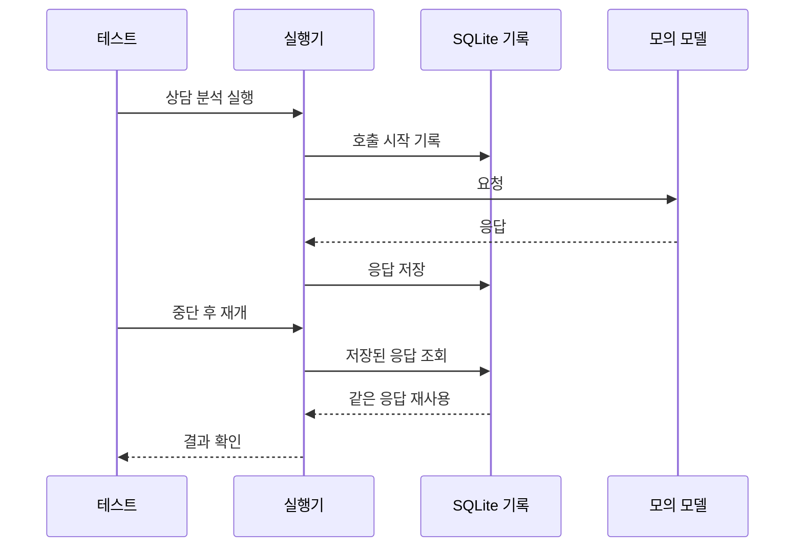

# 게시 전 테스트 기록

검증 날짜: 2026-09-15. Python 3.12, mcp 2.2.0의 기존 실험용 가상환경을 사용했다. 테스트는 실제 과금 모델을 호출하지 않는다.

| 대상 | 명령 | 결과 |
|---|---|---|
| 원본, 기본 Python | `python3 -m unittest discover -s tests -v` | 48개 탐색, 오류 9개. mcp 미설치로 일부 테스트 수집 실패 |
| 원본, MCP 가상환경 | `python -m unittest discover -s tests -v` | 50개 통과, 1.682초 |
| 실행 엔진만 분리 | 같은 명령 | 39개 통과, 1.487초 |
| 환경변수 연결 구현 전 | `python -m unittest discover -s tests -p test_portable_client.py` | 2개 오류. client_from_env 미구현 확인 |
| 비교 실행기와 환경변수 연결 포함 | `python -m unittest discover -s tests -v` | 52개 통과, 1.194초 |

명령은 `experiments/consultation-agent`에서 실행한다. 준비 중 저장소 루트에서 테스트 경로만 지정한 한 번의 실행은 `experiment` 모듈을 찾지 못해 수집에 실패했다. 문서의 실행 위치로 이동해 다시 실행했다.

## 확인한 동작

| 영역 | 확인 내용 |
|---|---|
| 입력·출력 | 공통 최초 응답, 같은 출력 계약, 상담원 발화를 고객 근거로 사용하지 않음 |
| MCP | 실제 stdio 연결, 도구 목록과 호출 결과, 입력 해시 불일치 거부 |
| 실행 | 호출·비용 상한, 반복 도구 호출 중단, 도구 오류와 잘못된 응답 기록 |
| 복구 | 완료 결과 재사용, 단계 응답 재사용, 불확실한 외부 호출 자동 반복 금지 |
| 채점 | 누락 짝 거부, 과검출·누락 계산, 보류를 완전 일치로 세지 않음 |
| 인증 | OPENAI_API_KEY 전달, 키가 없으면 HTTP 클라이언트 생성 전 중단 |

## 남은 범위

FastAPI 서버 전체 테스트와 운영 배포 검증은 실행하지 않았다. 코드가 추가된 독립 실험 디렉터리의 동작을 확인했다. 감정 정확도, 실제 고객 조치와 이탈률 변화는 이 테스트로 증명하지 않는다.
